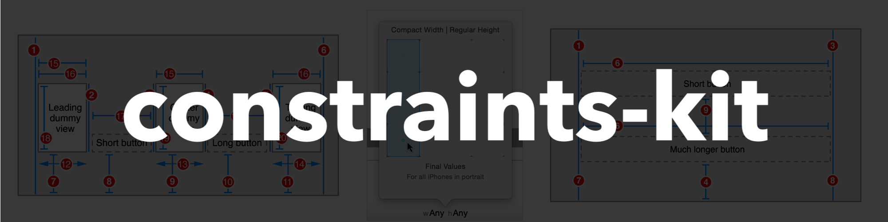

# constraints-kit 

**Last Update: 09/November/2018.**

# ✍️ About 
🏗 Declarative, Chainable & Lightweight Auto Layout constraints framework for iOS. The framework offeres a rich set of methods for defining `Auto Layout` constraints (see `Contents`). Choose one or several chainable methods in order to describe `Auto Layout` constraints programmtically.

# 📝 Contents 
The kit contains several groups of methods, each with specific purpose. Each group has a prefix and a description:

# 🏗 Installation

# ✈️ Usage

# 📺 Demo

# 👨‍💻 Author 
[Astemir Eleev](https://github.com/jVirus)

# 🔖 Licence 
The project is available under [MIT Licence](https://github.com/jVirus/collection-flow-layout-ios/blob/master/LICENSE)
